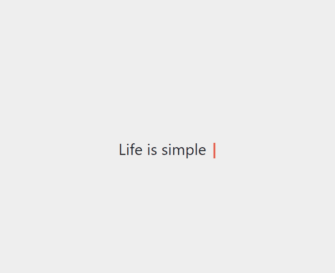

# React Simple Typewriter

> A simple react component for adding a nice typewriter effect to your project.

[](https://www.npmjs.com/package/react-simple-typewriter) [](https://standardjs.com)

<p align="center">
  
</p>

## Install

#### npm

```sh
npm i react-simple-typewriter
```

#### Yarn

```sh
yarn add react-simple-typewriter
```

## Breaking Changes in v2

- Named Imports.
- Injected **css** style.

---

## Usage

```jsx
import { Typewriter, useTypewriter, Cursor } from 'react-simple-typewriter'
```

## 1. Component

```jsx
import React from 'react'
import { Typewriter } from 'react-simple-typewriter'

const MyComponent = () => {
  return (
    <div className='App'>
      <Typewriter {/* Props */} />
    </div>
  )
}
```

### Component Props

| Prop          |       Type        | Options  | Description                                                                                  |      Default       |
| ------------- | :---------------: | -------- | -------------------------------------------------------------------------------------------- | :----------------: |
| `words`       |       Array       | Required | Array of strings holding the words                                                           | `['Hello', '...']` |
| `typeSpeed`   |      Number       | Optional | Character typing speed in Milliseconds                                                       |        `90`        |
| `deleteSpeed` |      Number       | Optional | Character deleting speed in Milliseconds                                                     |        `50`        |
| `delaySpeed`  |      Number       | Optional | Delay time between the words in Milliseconds                                                 |       `1500`       |
| `loop`        | Number \| Boolean | Optional | Control how many times to run. `0 \| false` to run infinitely                                |        `1`         |
| `onLoopDone`  |     Function      | Optional | Callback `Function` that is triggered when loops are completed. available if `loop` is `> 0` |        `-`         |
| `onType`      |     Function      | Optional | Callback `Function` that is runs while typing                                                |        `-`         |
| `cursor`      |      Boolean      | Optional | Show / Hide a cursor                                                                         |       `true`       |
| `cursorStyle` |      String       | Optional | Change the cursor style available if `cursor` is `enabled`                                   |        `\|`        |

---

### Component Usage Example

```jsx
import React from 'react'
import { Typewriter } from 'react-simple-typewriter'

const MyComponent = () => {

  const handleType = (count: number) => {
    // access word count number
    console.log(count)}
  }

  const handleDone = () => {
    console.log(`Done after 5 loops!`)
  }

  return (
    <div className='App'>
      <h1 style={{ paddingTop: '5rem', margin: 'auto 0', fontWeight: 'normal' }}>
        Life is simple{' '}
        <span style={{ color: 'red', fontWeight: 'bold' }}>
          {/* Style will be inherited from the parent element */}
          <Typewriter
            words={['Eat', 'Sleep', 'Code', 'Repeat!']}
            loop={5}
            cursor
            cursorStyle='_'
            typeSpeed={70}
            deleteSpeed={50}
            delaySpeed={1000}
            onLoopDone={handleDone}
            onType={handleType}
          />
        </span>
      </h1>
    </div>
  )
}
```

## 2. Hook

```jsx
import { useTypewriter } from 'react-simple-typewriter'

const MyComponent = () => {
  /**
   *
   * @returns
   * text: [string] typed text
   * count: [number] typed word count
   */
  const { text, count } = useTypewriter({
    /* Config */
  })

  return (
    <div className='App'>
      <span>{text}</span>
    </div>
  )
}
```

### Hook Config

| Prop          |       Type        | Options  | Description                                                                                  |      Default       |
| ------------- | :---------------: | -------- | -------------------------------------------------------------------------------------------- | :----------------: |
| `words`       |       Array       | Required | Array of strings holding the words                                                           | `['Hello', '...']` |
| `typeSpeed`   |      Number       | Optional | Character typing speed in Milliseconds                                                       |        `80`        |
| `deleteSpeed` |      Number       | Optional | Character deleting speed in Milliseconds                                                     |        `50`        |
| `delaySpeed`  |      Number       | Optional | Delay time between the words in Milliseconds                                                 |       `1500`       |
| `loop`        | Number \| Boolean | Optional | Control how many times to run. `0 \| false` to run infinitely                                |        `1`         |
| `onLoopDone`  |     Function      | Optional | Callback `Function` that is triggered when loops are completed. available if `loop` is `> 0` |        `-`         |
| `onType`      |     Function      | Optional | Callback `Function` that is triggered while typing                                           |        `-`         |

### Hook Usage Example

```jsx
import React from 'react'
import { useTypewriter} from 'react-simple-typewriter'

const MyComponent = () => {

  const {text} = useTypewriter({
    words: ['Hello', 'From', 'Typewriter', 'Hook!'],
    loop: {0}, // Infinit
  })

  return (
    <div className='App'>
      <span>{text}</span>
    </div>
  )
}
```

### Hook with Cursor

If you like to have the **Cursor** effect, you can `import` it as a `Component`

```jsx
import React from 'react'
import { useTypewriter, Cursor} from 'react-simple-typewriter'

const MyComponent = () => {

  const {text} = useTypewriter({
    words: ['Hello', 'From', 'Typewriter', 'Hook!'],
    loop: {3},
    onLoopDone: () => console.log(`loop completed after 3 runs.`),
  })

  return (
    <div className='App'>
      <span>{text}</span>
      <Cursor />
    </div>
  )
}
```

### Cursor Component Props

| Prop          |  Type  | Options  | Description             | Default |
| ------------- | :----: | -------- | ----------------------- | :-----: |
| `cursorStyle` | String | Optional | Change the cursor style |  `\|`   |

---

### [Demo](https://react-simple-typewriter.vercel.app/)

<br />

[](https://codesandbox.io/s/react-simple-typewriter-uj8ix?fontsize=14&hidenavigation=1&theme=dark)

### License

MIT © [awran5](https://github.com/awran5/)
